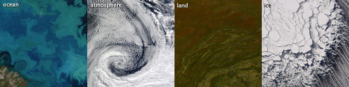

---

output:
  xaringan::moon_reader:
    lib_dir: libs
    css:  ["xaringan-themer.css"]
    nature:
      highlightStyle: github
      highlightLines: true
      countIncrementalSlides: false
---
class: center, middle, inverse
background-image: url(week_2/Moderate_Resolution_Imaging_Spectroradiometer_643662448f.jpg)
background-size: cover

# MODIS
### Remote Sensing  

---
## Content

This presentation will cover;
- What the **MODIS** sensor
- Interesting facts about MODIS
- Applications of MODIS
- Case study of MODIS in action
- Comparison of MODIS with other sensors
- Reflection on MODIS.

---

## What is MODIS?

MODIS stands for **Moderate Resolution Imaging Spectroradiometer**. It was developed by NASA and first launched aboard the **Terra satellite** on December 18, 1999, followed by the **Aqua satellite** on May 4, 2002 (“MODIS Web,” n.d.).

Data from MODIS is transmitted to ground stations via the Tracking and Data Relay Satellite System (TDRSS). It is then processed through the MODIS Adaptive Processing System (MODAPS). For ocean-specific features, further processing is handled by the Ocean Colour Data Processing System (OCDPS) before being published.

--
### Key features.
- Operates onboard Terra and Aqua satellites.
-	Has 3 spatial resolutions - - 250m, 500m, and 1,000m
-	Revisit time of 1-2days
-	Has 36 spectral bands spanning visible, infrared, and thermal wavelengths.

 
---
### Interesting facts about MODIS

- Among the Terra sensors, MODIS  tracks some environmental indicators such as the earth’s cloud cover per day. 
- It has sweeping **2330-km** wide viewing swath  
- In 2023, the MODIS team received the Earth Science and Applications Award 
- This recognized MODIS' long-term contribution to understanding global environmental change and the team’s efforts in advancing Earth observation science

 

Source: [Ocean Color NASA](https://oceancolor.gsfc.nasa.gov/about/missions/terra/)

---
### Applications of MODIS

Generally, MODIS monitors large-scale changes in the environment. This includes:
1.	Land Surface Monitoring – Snow/ice extent, chlorophyll fluorescence
2.	Ocean and water monitoring.
3.	Carbon cycle monitoring: Tracks CO₂ sources and sinks
4.	Cloud monitoring: Monitors formation, coverage, movement
5.	Monitoring Aerosols: Measures concentration and properties 
6.  Atmospheric monitoring:  Ozone and gas monitoring to sustain air quality insights

 

Source: [NASA TERRA ](https://terra.nasa.gov/about/terra-instruments/modis)

---
###  Case study: 

#### Global estimation of burned area using MODIS active fire observations by Giglio et al (2006)

This paper introduces a method to estimate monthly global burned area using MODIS active fire data and vegetation cover information.

The method used was regional regression trees based on fire pixel (MOD14/MYD14) clusters and vegetation types, with corrections for tropical deforestation. 

The 500m resolution imagery from Terra MODIS was used to map the fire scars on land. The temporal resolution of MODIS was about 4 years (2001–2004).

The results  show strong agreement with independent fire data from Canada, the US, and Russia, offering a reliable interim global burned area dataset.

The final outcome was tested against independent record of wildfire incidents by Canada, US and Russia. This showed strong agreement with them, offering a reliable interim global burned area dataset.

 
---

### Key Insights:

-  MODIS data was main dataset which provided both the active fire observations used for calibration and the burned area data being estimated.

- It also supplied valuable vegetation cover data, which enhanced the accuracy of the results. 

A map of the active fire regions land cover from the study is shown below.

Source: [Giglio et al (2006)](https://acp.copernicus.org/articles/6/957/2006/acp-6-957-2006.pdf)

---
### Comparison of MODIS with other sensors

This articles reviews surface Urban Heat Island. It makes a comparison of satellites as they provide different sources data of  for the study. Here is a summary of the findings.(Zhou et al., 2019)

--

| Feature                                     | Landsat  | MODIS | ASTER |
|---------------------------------------------|---------|--------|------|
| Frequency of use                       | Mostly used – **53%** | Moderately used – **25%**  | Less used – **7%** |
| Spatial Resolution                | High spatial resolution (60-120m) | Medium to coarse spatial resolution (1 km for thermal) | High spatial resolution (~90m) |
| Temporal Resolution                    | Low temporal resolution (16 days) | High temporal resolution (1-2 days) | Varying temporal resolution |
| Daytime and Nighttime Data              | Data available primarily for daytime | Data available for both daytime and nighttime | Data available for both daytime and nighttime |
| Atmospheric Correction for Standard Products | Corrections previously not done for all products before publications | Corrections done before publications | Corrections not done for all products before publications |

 

From this table, MODIS has a high temporal resolution and atmospheric corrections done before publication. This makes it easy and ideal for monitoring dynamic environmental changes.

---
### Reflection on MODIS.

#### From the previous slide,
- MODIS is well-suited for research on environmental events, especially those that occur over short time periods. Its high temporal resolution (1–2 days) gives it an advantage for time-sensitive natural events.
- The fact that atmospheric corrections are applied before publication also makes it easier to compare results across studies, adding to its reliability in scientific research.

#### Other reflections on MODIS include:

- Xaringan is a great tool for creating presentations. It is easy to use but can be time consuming when create slides with a lot of small details.
- Aagin, MODIS short revisit time can make it an ideal sensor for creating a digital twin of the earth, which can be used to monitor and predict environmental changes in real-time. 
- However, the spatial resolution not being high, can pose a challenge when monitoring small-scale environmental changes.
- This brings to mind the need model to be developed to enhance the spatial resolution of old satellites such as MODIS, to make them more useful.
  
---
### References

L, Giglio, Werf, G., Randerson, J., Collatz, G., Kasibhatla, P., 2006. Global estimation of burned area using MODIS active fire observations. Atmospheric Chem. Phys. 5. https://doi.org/10.5194/acp-6-957-2006

NASA, MODIS Data. URL https://modis.gsfc.nasa.gov/data/ (accessed 3.13.25).

NASA TERRA, MODIS NASA TERRA. URL https://terra.nasa.gov/about/terra-instruments/modis (accessed 3.27.25).

Zhou, D., Xiao, J., Bonafoni, S., Berger, C., Deilami, K., Zhou, Y., Frolking, S., Yao, R., Qiao, Z., Sobrino, J.A., 2019. Satellite Remote Sensing of Surface Urban Heat Islands: Progress, Challenges, and Perspectives. Remote Sens. 11, 48. https://doi.org/10.3390/rs11010048

---

class: center, middle

# Thanks!

Slides created via the R package [**xaringan**](https://github.com/yihui/xaringan).

