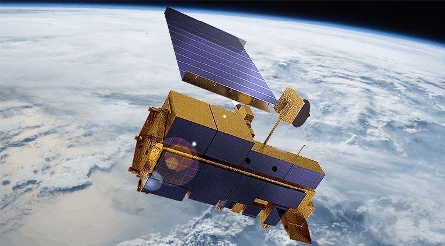
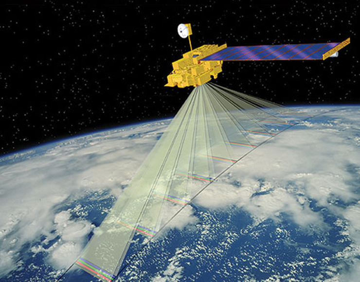
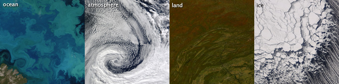

# Content

In this presentation we will be looking at;
- What the **MODIS** sensor
- Interesting facts about MODIS
- Applications of MODIS
- Case study of MODIS in action
- Comparison of MODIS with other sensors
- Reflection on MODIS.

{style="width:40%; display: block; margin: auto;"}
---
### Background 
**MODIS** stands for Moderate Resolution Imaging Spectroradiometer. It was developed by NASA. It was first launched aboard the Terra satellite on December 18, 1999 and later on the Aqua satellite on May 4, 2002. (“MODIS Web,” n.d.).
The data from MODIS is transmitted to ground stations through via Tracking and Data Relay Satellite System (TDRSS). It is then processed using the MODIS Adaptive Processing System (MODAPS). Further processing on ocean features is done by Ocean Colour Data Processing System (OCDPS) before published.

--
### Key features.
- It is onboard Terra and Aqua satellites as a sensor.
-	Has 3 spatial resolutions - - 250m, 500m, and 1,000m
-	It has a revisit time of 1-2days
-	Has 36 bands covering visible, infrared, and thermal wavelengths.
  
---
### Interesting facts about MODIS

- Amongst the Terra sensors it monitors the earth’s vitals such as monitoring earth’s cloud cover per day. 
- It has sweeping 2330-km wide viewing swath  
- In 2023, team responsible for the MODIS was awarded the Earth Science and Applications Award by the American Astronautical Society.
- This was in recognition of the teams effort in developing MODIS which has provided detailed data on the Earth’s dynamic process and global environmental changes.

{style="width:40%; display: block; margin: auto;"}

---
### Applications of MODIS

Generally, it is used for general monitoring large-scale changes in the environment. 
 This involves:
1.	Land Surface Monitoring – Such as areal extent of snow and ice during winter storms, Also monitoring the measuring chlorophyll fluorescence.
2.	Ocean and water monitoring.
3.	Carbon cycle monitoring: Idenfitying sources and sinks of carbon dioxide
4.	Cloud monitoring: Tracks the 
5.	Monitoring Aersols in the atmosphere. Measures the properties of the aerosols (Thome, n.d.)
6.  Atmospheric monitoring: Measures the concentration of ozone in the atmosphere.

---
###  Case study of MODIS in action
Estimating burnt land cover (L et al., 2006)
In this paper involves MODIS data being used to estimate wildfires. The 500m resolution imagery from Terra Modis to map the fire scar on land. This then used to adjust the fire pixels (MOD14/MYD14) detected from MODIS as alongside, other environmental variables through a regression tree. The final outcome was tested against independent record of wildfire incidents by Canada, US and Russia. The paper was able to identify the Northern Hemisphere Africa as the most fire-active region.

The findings indicate that MODIS gives both fire pixel as well as normal surface reflectance imagery. These can be used to determine fire active regions and their contribution it carbon emissions.

background-image: url(week_2/Estimating burnt land cover.jpg)
background-size: cover
---
### Comparison of MODIS with other sensors

This articles reviews surface Urban Heat Island and how satellites are used to as a vital source of data to research on it. The paper also review the comparisons between the satellite sensors - Landsat, MODIS, and ASTER. Here is a summary of the findings.(Zhou et al., 2019)

--

| Feature                                     | Landsat  | MODIS | ASTER |
|---------------------------------------------|---------|--------|------|
| Frequency of use                       | Mostly used – **53%** | Moderately used – **25%**  | Less used – **7%** |
| Spatial Resolution                | High spatial resolution (60-120m) | Medium to coarse spatial resolution (1 km for thermal) | High spatial resolution (~90m) |
| Temporal Resolution                    | Low temporal resolution (16 days) | High temporal resolution (1-2 days) | Varying temporal resolution |
| Daytime and Nighttime Data              | Data available primarily for daytime | Data available for both daytime and nighttime | Data available for both daytime and nighttime |
| Atmospheric Correction for Standard Products | Corrections previously not done for all products before publications | Corrections done before publications | Corrections not done for all products before publications |

From this table, MODIS has a high temporal resolution and atmospheric corrections done before publication. This makes it ideal for monitoring dynamic environmental changes.

---
### Reflection on MODIS.

From the previous slide,
- The MODIS can be fairly used for research work on environmental events though it has some flawless. This is not to mention that fact that some natural occurrences happen within a short period of time. Could be a couple of days so the temporal resolution of MODIS gives it a great advantage in time conscious natural events. Also, the atmospheric corrections done before publication makes it easier to compare results from different papers. 

Other general reflections on MODIS include:

- The MODIS sensor is a vital remote sensing tool that provides a vast dataset due to its short revisit period, making it ideal for monitoring dynamic environmental changes. While MODIS has a low spatial resolution, its frequent observations allow researchers to track time-sensitive events effectively
- For example, it can be used during natural disaster monitoring, such as wildfires to understand the trend of event and map out hotspots. This is particularly useful for identifying areas prone to natural disasters and implementing preventive policies to mitigate potential impacts
- Climate change is a still a debated story, with opposition claiming the theory is based on faulty climate models. The vast temporal and detailed data from MODIS sensor can be used to as training data for improving the models to understand climate change. The data may include detailed temporal data on cloud cover, aerosols, and temperature variations. 
- The dataset can be used to in conjunction with machine learning climate models to improve climate models, addressing concerns about the accuracy of climate change predictions. Thus, improving long-term weather forecasting and climate change simulations
  
---
### References

L, G., Werf, G., Randerson, J., Collatz, G., Kasibhatla, P., 2006. Global estimation of burned area using MODIS active fire observations. Atmospheric Chem. Phys. 5. https://doi.org/10.5194/acp-6-957-2006

MODIS Web [WWW Document], n.d. URL https://modis.gsfc.nasa.gov/data/ (accessed 3.13.25).

Thome, K., n.d. MODIS | Terra [WWW Document]. URL https://terra.nasa.gov/about/terra-instruments/modis (accessed 3.13.25).

Zhou, D., Xiao, J., Bonafoni, S., Berger, C., Deilami, K., Zhou, Y., Frolking, S., Yao, R., Qiao, Z., Sobrino, J.A., 2019. Satellite Remote Sensing of Surface Urban Heat Islands: Progress, Challenges, and Perspectives. Remote Sens. 11, 48. https://doi.org/10.3390/rs11010048

---

class: center, middle

# Thanks!

Slides created via the R package [**xaringan**](https://github.com/yihui/xaringan).

